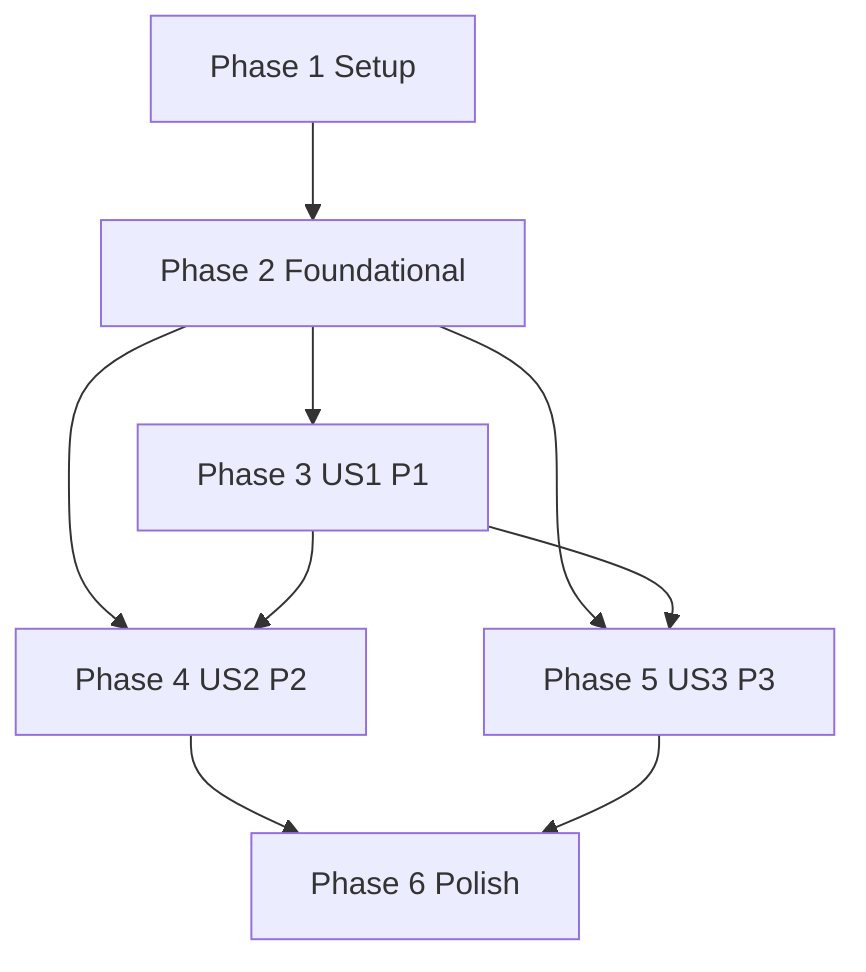

# Tasks: Orchestrator Single Entry Point

**Input**: Design documents from `/specs/001-orchestrator-entry-point/`

**Prerequisites**: plan.md, spec.md, research.md, data-model.md, contracts/orchestrator-ingress.openapi.yaml, quickstart.md

**Tests**: Behavior changes are in scope, so test tasks are included for each user story.

**Organization**: Tasks are grouped by user story to support independent implementation, testing, and delivery.

## Format: `[ID] [P?] [Story] Description`

- **[P]**: Can run in parallel (different files, no dependencies on incomplete tasks)
- **[Story]**: User story label (`[US1]`, `[US2]`, `[US3]`) for story-phase tasks only
- Every task includes an exact repository file path

## Phase 1: Setup (Shared Infrastructure)

**Purpose**: Prepare shared project scaffolding for orchestrator-ingress implementation and validation.

- [X] T001 Align feature validation commands in `/Users/shuhaicui/gitrepo/speckit-magent/specs/001-orchestrator-entry-point/quickstart.md` with concrete pytest targets to be implemented
- [X] T002 [P] Add orchestrator ingress test marker conventions in `/Users/shuhaicui/gitrepo/speckit-magent/agentservice/pyproject.toml`
- [X] T003 [P] Create orchestrator ingress test package scaffolding in `/Users/shuhaicui/gitrepo/speckit-magent/agentservice/tests/workflows/test_orchestrator_ingress.py`

---

## Phase 2: Foundational (Blocking Prerequisites)

**Purpose**: Define shared typed contracts and services that all user stories depend on.

**⚠️ CRITICAL**: No user story implementation should begin before this phase is complete.

- [X] T004 Create orchestrator ingress request/response typed models in `/Users/shuhaicui/gitrepo/speckit-magent/agentservice/src/models/state.py`
- [X] T005 [P] Add routing decision and routing record event types/builders in `/Users/shuhaicui/gitrepo/speckit-magent/agentservice/src/models/events.py`
- [X] T006 Implement routing record service interface and in-memory implementation in `/Users/shuhaicui/gitrepo/speckit-magent/agentservice/src/services/routing_service.py`
- [X] T007 [P] Export routing service module from `/Users/shuhaicui/gitrepo/speckit-magent/agentservice/src/services/__init__.py`
- [X] T008 Add shared API error payload helpers for ingress/rejection/failure paths in `/Users/shuhaicui/gitrepo/speckit-magent/agentservice/src/api/routes/chat.py`
- [X] T009 Wire foundational orchestrator service dependencies in `/Users/shuhaicui/gitrepo/speckit-magent/agentservice/src/api/main.py`

**Checkpoint**: Foundational types and shared services are ready; user stories can be implemented independently.

---

## Phase 3: User Story 1 - Route All Requests Through Orchestrator (Priority: P1) 🎯 MVP

**Goal**: Ensure all accepted client assistant requests enter through orchestrator first and retain capability coverage.

**Independent Test Criteria**: Submit representative calendar/travel/dining/news/companion requests to orchestrator ingress and verify accepted responses always indicate `initial_handler=orchestrator` with a routed domain.

### Tests for User Story 1

- [X] T010 [P] [US1] Add contract-style ingress acceptance tests for `POST /v1/assistant/requests` in `/Users/shuhaicui/gitrepo/speckit-magent/agentservice/tests/workflows/test_orchestrator_ingress.py`
- [X] T011 [P] [US1] Add orchestrator routing decision tests covering domain routing and explicit low-confidence fallback to Companion in `/Users/shuhaicui/gitrepo/speckit-magent/agentservice/tests/agents/test_orchestrator_agent.py`
- [X] T012 [US1] Add integration tests asserting orchestrator is first handler for accepted requests in `/Users/shuhaicui/gitrepo/speckit-magent/agentservice/tests/workflows/test_orchestrator_workflow_routing.py`

### Implementation for User Story 1

- [X] T013 [US1] Implement orchestrator intent detection and target-domain selection with Companion fallback below confidence threshold in `/Users/shuhaicui/gitrepo/speckit-magent/agentservice/src/agents/orchestrator_agent.py`
- [X] T014 [US1] Implement orchestrator-first graph flow (`Load Context → Intent Detection → Route Request`) in `/Users/shuhaicui/gitrepo/speckit-magent/agentservice/src/graph/main_graph.py`
- [X] T015 [US1] Implement `POST /v1/assistant/requests` ingress handler and orchestrator dispatch in `/Users/shuhaicui/gitrepo/speckit-magent/agentservice/src/api/routes/chat.py`
- [X] T016 [US1] Register orchestrator ingress route and dependency wiring in `/Users/shuhaicui/gitrepo/speckit-magent/agentservice/src/api/main.py`
- [X] T017 [US1] Update OpenAPI contract for successful orchestrator ingress response parity in `/Users/shuhaicui/gitrepo/speckit-magent/specs/001-orchestrator-entry-point/contracts/orchestrator-ingress.openapi.yaml`
- [X] T034 [US1] Add explicit contract examples for low-confidence Companion fallback in `/Users/shuhaicui/gitrepo/speckit-magent/specs/001-orchestrator-entry-point/contracts/orchestrator-ingress.openapi.yaml`

**Checkpoint**: US1 is independently testable as MVP via orchestrator-only accepted ingress.

---

## Phase 4: User Story 2 - Prevent Direct Specialist Access (Priority: P2)

**Goal**: Deny client attempts to directly invoke specialist agents while keeping orchestrator ingress available.

**Independent Test Criteria**: Attempt direct specialist invocation for each supported specialist domain and verify 403 rejection with a clear user-facing message and no specialist execution.

### Tests for User Story 2

- [X] T018 [P] [US2] Add API tests for `POST /v1/agents/{agent}/invoke` direct-access denial in `/Users/shuhaicui/gitrepo/speckit-magent/agentservice/tests/workflows/test_direct_specialist_access.py`
- [X] T019 [US2] Add regression tests proving orchestrator ingress still accepts equivalent intents in `/Users/shuhaicui/gitrepo/speckit-magent/agentservice/tests/workflows/test_orchestrator_ingress.py`
- [X] T035 [P] [US2] Add API tests for malformed/incomplete ingress payloads returning validation errors and no specialist execution in `/Users/shuhaicui/gitrepo/speckit-magent/agentservice/tests/workflows/test_orchestrator_ingress_validation.py`

### Implementation for User Story 2

- [X] T020 [US2] Implement direct specialist invocation denial handler with user-facing message in `/Users/shuhaicui/gitrepo/speckit-magent/agentservice/src/api/routes/chat.py`
- [X] T021 [US2] Ensure denied direct invocations never reach specialist dispatch in `/Users/shuhaicui/gitrepo/speckit-magent/agentservice/src/graph/main_graph.py`
- [X] T022 [US2] Add explicit `direct_specialist_access_denied` payload mapping in `/Users/shuhaicui/gitrepo/speckit-magent/agentservice/src/models/events.py`
- [X] T023 [US2] Update OpenAPI 403 contract for specialist direct invocation attempts in `/Users/shuhaicui/gitrepo/speckit-magent/specs/001-orchestrator-entry-point/contracts/orchestrator-ingress.openapi.yaml`
- [X] T036 [US2] Implement malformed/incomplete ingress payload handling with clear 400/422 error responses in `/Users/shuhaicui/gitrepo/speckit-magent/agentservice/src/api/routes/chat.py`
- [X] T037 [US2] Update OpenAPI contract with malformed/incomplete request error schemas and examples in `/Users/shuhaicui/gitrepo/speckit-magent/specs/001-orchestrator-entry-point/contracts/orchestrator-ingress.openapi.yaml`

**Checkpoint**: US2 is independently testable with deterministic 403 specialist entry rejection.

---

## Phase 5: User Story 3 - Preserve Request Traceability (Priority: P3)

**Goal**: Persist routing records that always identify orchestrator as the first handler for successful and failed downstream outcomes.

**Independent Test Criteria**: For both success and simulated downstream failure, verify a routing record exists with orchestrator initial handler, routed domain, and final status.

### Tests for User Story 3

- [X] T024 [P] [US3] Add routing record success-path tests in `/Users/shuhaicui/gitrepo/speckit-magent/agentservice/tests/workflows/test_orchestrator_routing_records.py`
- [X] T025 [P] [US3] Add downstream-failure traceability tests preserving orchestrator-first metadata in `/Users/shuhaicui/gitrepo/speckit-magent/agentservice/tests/workflows/test_orchestrator_failure_records.py`
- [X] T026 [US3] Add service-level tests for routing record lifecycle transitions in `/Users/shuhaicui/gitrepo/speckit-magent/agentservice/tests/services/test_routing_service.py`

### Implementation for User Story 3

- [X] T027 [US3] Implement routing record creation/update lifecycle methods in `/Users/shuhaicui/gitrepo/speckit-magent/agentservice/src/services/routing_service.py`
- [X] T028 [US3] Emit orchestrator routing record events for success and failure paths in `/Users/shuhaicui/gitrepo/speckit-magent/agentservice/src/models/events.py`
- [X] T029 [US3] Wire routing record persistence into ingress handling and downstream error paths in `/Users/shuhaicui/gitrepo/speckit-magent/agentservice/src/api/routes/chat.py`
- [X] T030 [US3] Return user-facing failure response while retaining routing record on downstream errors in `/Users/shuhaicui/gitrepo/speckit-magent/agentservice/src/agents/orchestrator_agent.py`

**Checkpoint**: US3 is independently testable with auditable routing records for success and failure outcomes.

---

## Phase 6: Polish & Cross-Cutting Concerns

**Purpose**: Final consistency, documentation, and full-scenario validation.

- [X] T031 [P] Document orchestrator ingress behavior and specialist-denial policy in `/Users/shuhaicui/gitrepo/speckit-magent/docs/architecture.md`
- [X] T032 [P] Add deployment/operations notes for routing-record audit checks in `/Users/shuhaicui/gitrepo/speckit-magent/docs/deployment.md`
- [X] T033 Execute quickstart validation suite and capture SC-001 evidence using a stratified sample of at least 200 accepted requests per release candidate (minimum 40 per supported domain) in `/Users/shuhaicui/gitrepo/speckit-magent/specs/001-orchestrator-entry-point/quickstart.md`
- [X] T038 [P] Add reliability validation scenario and pass/fail thresholds for SC-003 in `/Users/shuhaicui/gitrepo/speckit-magent/specs/001-orchestrator-entry-point/quickstart.md`
- [X] T039 Execute 1-hour normal-operations validation run and record SC-003 success-rate evidence in `/Users/shuhaicui/gitrepo/speckit-magent/specs/001-orchestrator-entry-point/quickstart.md`

---

## Dependencies & Execution Order

### Phase Dependencies

- Setup (Phase 1): starts immediately
- Foundational (Phase 2): depends on Setup completion and blocks all user stories
- User Story phases (Phase 3-5): depend on Foundational completion; execute in priority order for incremental delivery
- Polish (Phase 6): depends on completion of targeted user stories

### User Story Dependencies

- US1 (P1): starts after Foundational; no dependency on US2/US3
- US2 (P2): starts after Foundational; depends functionally on US1 ingress wiring for regression validation
- US3 (P3): starts after Foundational; depends functionally on US1 ingress flow and shared routing service

### Dependency Graph

---

## Parallel Opportunities

- T002 and T003 can run in parallel after T001
- T005 and T007 can run in parallel after T004/T006 planning is clear
- US1: T010 and T011 can run in parallel before T012
- US2: T018 can run in parallel with T019 when US1 ingress route is stable
- US3: T024 and T025 can run in parallel; T026 can run in parallel with both when routing service interface is stable
- Polish: T031 and T032 can run in parallel before T033

### Parallel Example: User Story 1

- Run T010 and T011 together, then complete T012
- Once tests are in place, implement T013 and T014 in sequence, then T015 and T016

### Parallel Example: User Story 3

- Run T024 and T025 together for workflow-level coverage
- In parallel, implement T026 against routing service behaviors before integrating T027-T029

---

## Implementation Strategy

### MVP First (US1 Only)

1. Complete Phase 1 Setup
2. Complete Phase 2 Foundational
3. Complete Phase 3 US1
4. Validate US1 independently with orchestrator-ingress test suite
5. Demo/deploy MVP behavior (orchestrator-first accepted ingress)

### Incremental Delivery

1. Deliver MVP via US1
2. Add US2 to enforce specialist direct-access denial
3. Add US3 to complete audit-grade routing traceability for success/failure
4. Finish with Polish tasks and full quickstart validation

### Team Parallelization Strategy

1. Team completes Setup + Foundational together
2. Developer A drives US1, Developer B prepares US2 tests, Developer C prepares US3 tests/service scaffolding
3. Merge US2 and US3 after US1 ingress baseline is stable

---

## Notes

- All tasks follow strict checklist format with sequential IDs, optional [P], required [USx] labels in story phases, and explicit file paths
- Test tasks are included because routing and policy behavior changes are core feature scope
- Event naming updates must remain compliant with `<domain>.<action>.<status>`
- Low-confidence routing must explicitly fall back to Companion per constitution requirements
