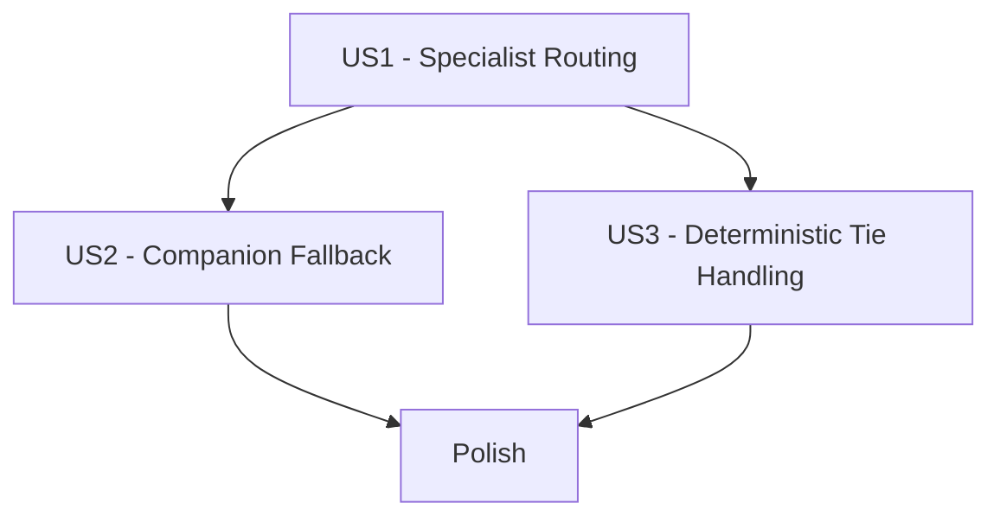

# Tasks: Intent Detection and Agent Routing

**Input**: Design documents from `/specs/002-intent-agent-routing/`

**Prerequisites**: plan.md, spec.md, research.md, data-model.md, contracts/orchestrator-intent-routing.openapi.yaml, quickstart.md

**Tests**: Test tasks are included because this feature changes routing behavior and requires deterministic, auditable outcomes.

## Phase 1: Setup (Shared Infrastructure)

**Purpose**: Prepare feature-scoped documentation, contract baseline, and test scaffolding.

- [X] T001 Align feature assumptions and routing constants in specs/002-intent-agent-routing/plan.md
- [X] T002 [P] Create contract test scaffold for route API in agentservice/tests/api/test_orchestrator_route_contract.py
- [X] T003 [P] Create workflow test module scaffolds for routing scenarios in agentservice/tests/workflows/test_intent_routing_specialist.py

---

## Phase 2: Foundational (Blocking Prerequisites)

**Purpose**: Build shared typed models and orchestration plumbing required by all stories.

**CRITICAL**: Complete this phase before any user story implementation.

- [X] T004 Expand routing type models for confidence sets, threshold checks, and rationale payloads in agentservice/src/models/state.py
- [X] T005 [P] Add typed routing policy and tie-break helpers in agentservice/src/models/routing.py
- [X] T006 Integrate structured routing decision event payload updates in agentservice/src/models/events.py
- [X] T007 Update orchestrator graph response shape to carry structured routing rationale in agentservice/src/graph/main_graph.py
- [X] T008 Add foundational unit tests for routing policy helpers in agentservice/tests/services/test_routing_policy.py

**Checkpoint**: Routing foundation is typed, testable, and reusable across all stories.

---

## Phase 3: User Story 1 - Route Requests to the Correct Specialist (Priority: P1) 🎯 MVP

**Goal**: Route clear single-domain requests to the correct specialist when confidence exceeds threshold.

**Independent Test**: Submit representative calendar/travel/dining/news requests and verify exactly one correct specialist route is selected with no fallback.

### Tests for User Story 1

- [X] T009 [P] [US1] Add specialist routing agent tests for high-confidence domain requests in agentservice/tests/agents/test_orchestrator_agent.py
- [X] T010 [P] [US1] Add workflow-level specialist routing coverage for single destination dispatch in agentservice/tests/workflows/test_intent_routing_specialist.py
- [X] T011 [P] [US1] Add contract assertions for successful specialist route response schema in agentservice/tests/api/test_orchestrator_route_contract.py

### Implementation for User Story 1

- [X] T012 [US1] Implement per-domain confidence scoring output for supported specialists in agentservice/src/agents/orchestrator_agent.py
- [X] T013 [US1] Enforce highest-confidence-above-threshold specialist selection logic in agentservice/src/agents/orchestrator_agent.py
- [X] T014 [US1] Persist selected specialist and rationale fields in routing records in agentservice/src/services/routing_service.py
- [X] T015 [US1] Wire orchestrator route response payload fields to contract schema in agentservice/src/graph/main_graph.py

**Checkpoint**: US1 is independently functional and demonstrates correct specialist routing.

---

## Phase 4: User Story 2 - Safe Fallback for Low Confidence (Priority: P2)

**Goal**: Route ambiguous or out-of-domain requests to companion when no specialist exceeds threshold.

**Independent Test**: Submit low-signal and unsupported requests and verify companion is always selected with fallback rationale populated.

### Tests for User Story 2

- [X] T016 [P] [US2] Add fallback behavior tests for low-confidence requests in agentservice/tests/agents/test_orchestrator_agent.py
- [X] T017 [P] [US2] Add workflow fallback tests for ambiguous and out-of-domain requests in agentservice/tests/workflows/test_intent_routing_fallback.py
- [X] T018 [P] [US2] Add contract tests validating fallback_to_companion and reason_code fields in agentservice/tests/api/test_orchestrator_route_contract.py

### Implementation for User Story 2

- [X] T019 [US2] Implement strict threshold exceedance check and companion fallback branch in agentservice/src/agents/orchestrator_agent.py
- [X] T020 [US2] Add below-threshold fallback rationale construction with reason_code mapping in agentservice/src/agents/orchestrator_agent.py
- [X] T021 [US2] Ensure fallback decision state is retained in routing records for traceability in agentservice/src/services/routing_service.py

**Checkpoint**: US2 is independently functional and guarantees safe fallback behavior.

---

## Phase 5: User Story 3 - Deterministic Routing Decisions (Priority: P3)

**Goal**: Produce deterministic routing outcomes under equivalent inputs, including tie-window handling.

**Independent Test**: Replay equivalent requests and verify identical destination/rationale; verify tie cases with delta <= 0.03 resolve via fixed precedence.

### Tests for User Story 3

- [X] T022 [P] [US3] Add tie-window and precedence tests for routing decision function in agentservice/tests/agents/test_orchestrator_agent.py
- [X] T023 [P] [US3] Add deterministic replay workflow tests for equivalent request inputs in agentservice/tests/workflows/test_intent_routing_tie_break.py
- [X] T024 [P] [US3] Add traceability tests for routing decision records and event names in agentservice/tests/workflows/test_routing_decision_record.py

### Implementation for User Story 3

- [X] T025 [US3] Implement tie detection for top confidence delta <= 0.03 in agentservice/src/agents/orchestrator_agent.py
- [X] T026 [US3] Apply fixed specialist precedence calendar > travel > dining > news during tie resolution in agentservice/src/agents/orchestrator_agent.py
- [X] T027 [US3] Persist policy snapshot fields (threshold, tie_window, precedence) with each decision in agentservice/src/services/routing_service.py
- [X] T028 [US3] Ensure emitted routing events use deterministic payload ordering and valid event names in agentservice/src/models/events.py

**Checkpoint**: US3 is independently functional and deterministic under replay.

---

## Phase 6: Polish & Cross-Cutting Concerns

**Purpose**: Complete documentation, regression verification, and release readiness.

- [X] T029 [P] Update quickstart validation commands and expected outcomes in specs/002-intent-agent-routing/quickstart.md
- [X] T030 [P] Document final routing policy behavior and operator notes in specs/002-intent-agent-routing/research.md
- [X] T031 Run full routing regression suite referenced by quickstart in agentservice/tests/workflows/test_intent_routing_specialist.py
- [X] T032 Run complete feature test bundle and capture success criteria evidence in specs/002-intent-agent-routing/spec.md

---

## Dependencies & Execution Order

### Phase Dependencies

- Setup (Phase 1) starts immediately.
- Foundational (Phase 2) depends on Setup and blocks all user stories.
- User Story phases (Phase 3-5) depend on Foundational completion.
- Polish (Phase 6) depends on completion of all selected user stories.

### User Story Dependency Graph



### User Story Dependencies

- US1 has no dependency on other user stories and defines the MVP routing path.
- US2 depends on US1 routing shape but remains independently testable via fallback scenarios.
- US3 depends on US1 scoring/selection logic and remains independently testable via tie and replay scenarios.

## Parallel Opportunities

- Phase 1: T002 and T003 can run in parallel.
- Phase 2: T005 and T008 can run in parallel after T004 starts.
- US1: T009, T010, and T011 can run in parallel.
- US2: T016, T017, and T018 can run in parallel.
- US3: T022, T023, and T024 can run in parallel.
- Polish: T029 and T030 can run in parallel.

## Parallel Example: User Story 1

```bash
# Parallel test authoring
Task T009 - agent tests in agentservice/tests/agents/test_orchestrator_agent.py
Task T010 - workflow tests in agentservice/tests/workflows/test_intent_routing_specialist.py
Task T011 - contract tests in agentservice/tests/api/test_orchestrator_route_contract.py
```

## Parallel Example: User Story 2

```bash
# Parallel fallback coverage
Task T016 - agent fallback tests in agentservice/tests/agents/test_orchestrator_agent.py
Task T017 - workflow fallback tests in agentservice/tests/workflows/test_intent_routing_fallback.py
Task T018 - contract fallback tests in agentservice/tests/api/test_orchestrator_route_contract.py
```

## Parallel Example: User Story 3

```bash
# Parallel determinism coverage
Task T022 - tie-window agent tests in agentservice/tests/agents/test_orchestrator_agent.py
Task T023 - replay determinism workflow tests in agentservice/tests/workflows/test_intent_routing_tie_break.py
Task T024 - routing decision record tests in agentservice/tests/workflows/test_routing_decision_record.py
```

## Implementation Strategy

### MVP First (US1 only)

1. Complete Phase 1 and Phase 2.
2. Complete Phase 3 (US1).
3. Validate US1 independently using T009-T011 before moving forward.

### Incremental Delivery

1. Deliver US1 for correct specialist routing.
2. Deliver US2 for safe fallback behavior.
3. Deliver US3 for deterministic tie handling and replayability.
4. Finish with Phase 6 polish and full-regression evidence capture.

### Format Validation

All tasks in this file follow the required checklist format:
- Checkbox prefix `- [ ]`
- Sequential task ID `T001` through `T032`
- `[P]` marker only on parallelizable tasks
- `[US#]` labels only in user-story phases
- Explicit file path in every task description
